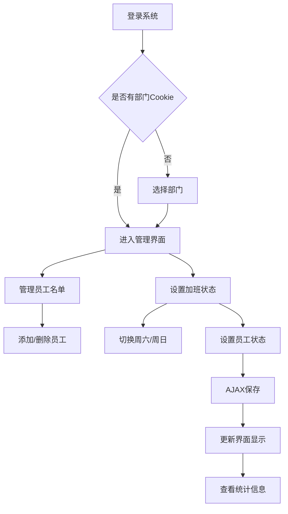
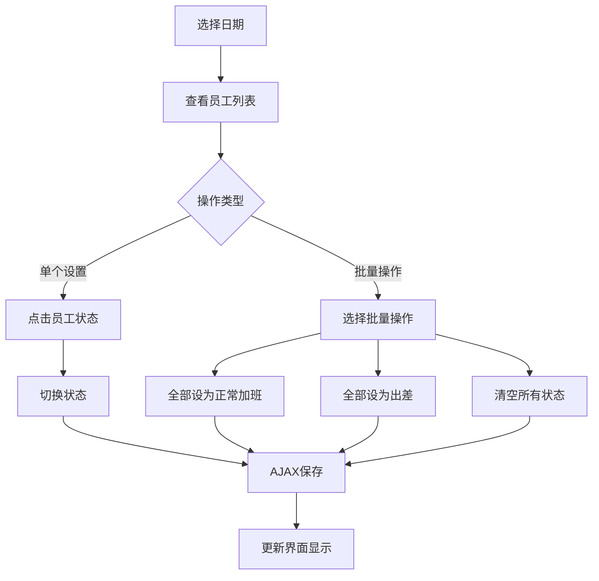
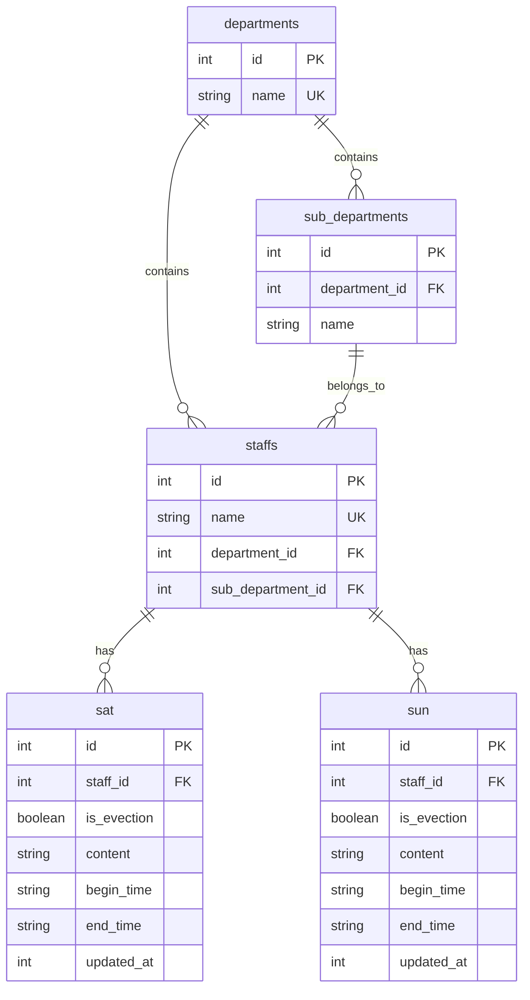

# 周末加班管理系统 - 产品需求文档 (PRD)

## 1. 产品概述

### 1.1 产品简介
周末加班管理系统是一个基于Web的企业级应用，用于统一管理企业各部门的周末加班人员安排和状态跟踪。系统支持多部门隔离管理，提供直观的界面进行加班人员状态设置、预设内容管理和实时数据查看。

### 1.2 产品目标
- 提高加班管理效率，减少人工统计工作量
- 实现加班信息的标准化和规范化管理
- 提供实时的加班状态查看和统计功能
- 支持多部门独立管理，确保数据安全隔离

### 1.3 目标用户
- **部门管理员**：负责管理本部门员工的加班安排
- **企业管理员**：查看全公司加班统计信息
- **员工**：查看个人加班安排（通过信息页面）

## 2. 用户角色与权限

### 2.1 部门管理员
- 选择并切换管理部门
- 添加/删除本部门员工
- 设置员工加班状态（正常加班/出差）
- 管理本部门的预设内容
- 查看本部门加班统计信息

### 2.2 系统访问者
- 查看全公司加班统计信息
- 按部门查看加班人员名单
- 区分正常加班和出差人员

## 3. 功能需求详述

### 3.1 部门管理模块

#### 3.1.1 部门选择
- **功能描述**：用户首次访问时需选择所属部门
- **业务规则**：
  - 部门信息存储在Cookie中，有效期1年
  - 支持部门间切换
  - 无效部门自动重定向到选择页面

#### 3.1.2 子部门支持
- **功能描述**：支持部门下的班组/子部门管理
- **业务规则**：
  - 员工可归属到具体子部门
  - 子部门信息在员工管理中显示

### 3.2 员工管理模块

#### 3.2.1 员工添加
- **功能描述**：向当前部门添加新员工
- **业务规则**：
  - 员工姓名在系统内唯一
  - 可选择归属子部门
  - 重复添加时自动更新部门归属

#### 3.2.2 员工删除
- **功能描述**：从当前部门移除员工
- **业务规则**：
  - 仅删除当前部门的员工记录
  - 清除相关的加班状态记录

### 3.3 加班状态管理模块

#### 3.3.1 状态类型
- **bg-1（默认）**：无加班
- **bg-2（正常加班）**：公司内加班
- **bg-3（出差）**：外出出差

#### 3.3.2 状态切换
- **功能描述**：通过AJAX实时切换员工加班状态
- **业务规则**：
  - 支持批量操作（全部设为正常加班/出差）
  - 支持一键清空所有加班状态
  - 状态变更实时保存到数据库

#### 3.3.3 日期管理
- **功能描述**：分别管理周六和周日的加班安排
- **业务规则**：
  - 支持日期切换查看
  - 每个员工每天只能有一种状态

### 3.4 预设管理模块

> **注意**：预设管理功能已从主界面移除，相关路由和模板已删除。如需恢复此功能，请重新实现相关路由和模板。

### 3.5 统计查看模块

#### 3.5.1 实时统计
- **功能描述**：按部门显示当前加班人员名单
- **业务规则**：
  - 区分周六和周日统计
  - 分别显示正常加班和出差人员
  - 按部门分组显示

#### 3.5.2 数据展示
- **功能描述**：以列表形式展示加班人员信息
- **业务规则**：
  - 支持多部门同时查看
  - 人员姓名按部门排序显示

## 4. 业务流程

### 4.1 部门管理员工作流程

### 4.2 加班状态设置流程

## 5. 数据模型设计

### 5.1 核心实体关系

### 5.2 状态说明
- **is_evection = 0**：正常加班（公司内）
- **is_evection = 1**：出差加班
- **无记录**：无加班

## 6. 非功能性需求

### 6.1 性能要求
- 页面响应时间 < 2秒
- 支持50+并发用户访问
- 数据库查询优化，避免N+1问题

### 6.2 安全要求
- 部门数据隔离，防止跨部门访问
- 输入数据验证，防止SQL注入
- 会话管理，Cookie安全设置

### 6.3 可用性要求
- 直观的用户界面，操作简单
- 支持主流浏览器访问
- 移动端友好响应式设计

### 6.4 可靠性要求
- 数据库事务保证数据一致性
- 异常处理和错误日志记录
- 自动数据库连接管理

## 7. 技术架构

### 7.1 技术栈
- **后端框架**：Flask 3.1.2
- **数据库**：SQLite（支持WAL模式）
- **前端技术**：HTML5 + CSS3 + JavaScript
- **部署方式**：单机部署

### 7.2 架构特点
- **MVC架构**：清晰的代码分层
- **模块化设计**：路由、数据库、模板分离
- **数据库优化**：WAL模式提升并发性能
- **错误处理**：完善的异常捕获和回滚机制

### 7.3 关键技术实现
- **数据库连接池**：Flask.g管理请求级连接
- **AJAX交互**：实时状态更新无需页面刷新
- **Cookie管理**：部门信息持久化存储
- **时间处理**：支持中国时区时间显示

## 8. 部署与运维

### 8.1 环境要求
- Python 3.8+
- SQLite 3.x
- 现代Web浏览器

### 8.2 部署步骤
1. 安装依赖：`pip install -r requirements.txt`
2. 初始化数据库：`flask init-db`
3. 启动应用：`flask run --reload`
4. 配置反向代理（生产环境）

### 8.3 数据备份
- 定期备份SQLite数据库文件
- 支持数据库导出和恢复
- 操作日志记录便于审计

## 9. 版本规划

### 9.1 当前版本 (v1.1)
- ✅ 基础加班管理功能
- ✅ 多部门支持
- ✅ 实时统计查看
- ✅ 安全性增强（输入验证、SQL注入防护）
- ✅ JavaScript错误处理优化

### 9.2 未来规划
- 📋 用户权限管理系统
- 📋 加班时长统计
- 📋 报表导出功能
- 📋 移动端APP
- 📋 邮件通知功能

---

**文档版本**：v1.1  
**创建日期**：2026年2月7日  
**最后更新**：2026年2月7日
